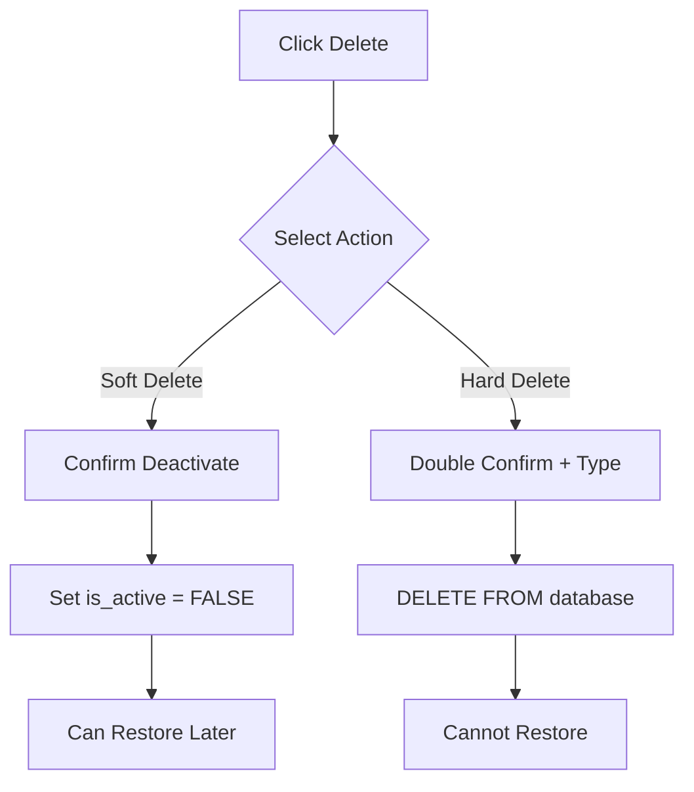
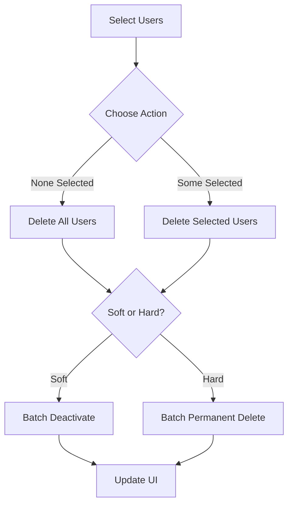

# 👥 Đề xuất Luồng Nghiệp vụ Quản lý User Lifecycle

## 🎯 **Tổng quan**

Hệ thống hiện tại đã implement **Soft Delete** đúng cách. Đề xuất mở rộng thành hệ thống quản lý lifecycle hoàn chỉnh với 3 mức độ xóa khác nhau.

## 📋 **1. Phân loại các loại Delete**

### **A. Soft Delete (Deactivate) - ✅ Đã có**
- **Mục đích**: Vô hiệu hóa tạm thời, giữ lại data để audit
- **Use cases**: 
  - Nhân viên nghỉ việc tạm thời
  - Tạm ngưng hoạt động do vi phạm
  - Chuyển bộ phận (cần review lại quyền)
- **Implementation**: `is_active = FALSE`, `leave_date = CURRENT_DATE`
- **Khôi phục**: Có thể reactivate bất cứ lúc nào

### **B. Hard Delete (Permanent) - ✅ Đã thêm**
- **Mục đích**: Xóa hoàn toàn khỏi database
- **Use cases**:
  - GDPR compliance (user yêu cầu xóa data)
  - Test accounts cleanup
  - Data breach response
  - Accounts tạo nhầm
- **Implementation**: `DELETE FROM users WHERE id = ?`
- **Khôi phục**: Không thể khôi phục

### **C. Archive (Future) - 💡 Đề xuất**
- **Mục đích**: Chuyển sang storage dài hạn
- **Use cases**: Sau 1-2 năm nghỉ việc
- **Implementation**: Move to `users_archived` table
- **Khôi phục**: Có thể restore từ archive

## 🎨 **2. UI/UX Design mới**

### **Dropdown Menu cho Delete Actions:**
```
🗑️ Xóa tất cả ▼
├── 👤 Vô hiệu hóa (Soft Delete)
├── 🗑️ Xóa vĩnh viễn (Hard Delete)  
├── ─────────────────────────
└── 👁️ Xem users đã vô hiệu hóa
```

### **Confirmation Levels:**
- **Soft Delete**: Simple confirm dialog
- **Hard Delete**: Double confirmation + type "PERMANENT DELETE"
- **Bulk operations**: Extra warning với số lượng

## 🔒 **3. Security & Permissions**

### **Role-based Access:**
- **Admin**: Full access (soft + hard delete)
- **PM/CPO**: Chỉ soft delete
- **Others**: Không có quyền delete

### **Audit Trail:**
- **Soft Delete**: Log `SOFT_DELETE` action
- **Hard Delete**: Log `PERMANENT_DELETE` với warning
- **Bulk operations**: Log với affected count

### **Protection Rules:**
- **Admin account**: Không bao giờ được xóa (id = 1)
- **Active sessions**: Warning khi xóa user đang online
- **Related data**: Check foreign key constraints

## 📊 **4. Business Logic Flow**

### **Individual User Delete:**


### **Bulk Delete Flow:**


## 🛡️ **5. Data Protection Strategy**

### **Retention Policy:**
- **Active users**: Indefinite retention
- **Deactivated users**: 2 years retention
- **Archived users**: 7 years retention (compliance)
- **Deleted users**: No retention (GDPR)

### **Backup Strategy:**
- **Before hard delete**: Auto-backup to audit table
- **Bulk operations**: Full database backup
- **Critical accounts**: Manual approval required

## 📈 **6. Monitoring & Analytics**

### **Metrics to Track:**
- **Deactivation rate**: Users deactivated per month
- **Reactivation rate**: Users restored from deactivated
- **Permanent deletion**: Hard deletes (should be rare)
- **Bulk operations**: Admin bulk actions

### **Alerts:**
- **Mass deletion**: Alert when >10 users deleted
- **Admin deletion**: Alert when admin account targeted
- **Unusual patterns**: Multiple deletes by same admin

## 🔧 **7. Implementation Status**

### **✅ Completed:**
- Soft delete functionality
- Hard delete API endpoints
- UI dropdown with multiple options
- Confirmation dialogs
- Audit logging
- Admin-only permissions

### **🚧 In Progress:**
- Show/hide inactive users toggle
- Bulk selection with checkboxes
- Smart delete button text

### **💡 Future Enhancements:**
- Archive functionality
- Restore from deactivated
- Advanced filtering (active/inactive/all)
- Export user data before deletion
- Scheduled cleanup jobs

## 📋 **8. Recommended Workflow**

### **For Regular Operations:**
1. **Default**: Always use Soft Delete
2. **Review**: Monthly review of deactivated users
3. **Archive**: Yearly move old deactivated to archive
4. **Cleanup**: Annual hard delete of very old data

### **For Special Cases:**
1. **GDPR Request**: Use Hard Delete immediately
2. **Security Breach**: Deactivate first, investigate, then decide
3. **Test Cleanup**: Use Hard Delete for test accounts
4. **Bulk Operations**: Always require manager approval

## 🎯 **9. Success Metrics**

- **Zero accidental deletions**: No unintended data loss
- **Fast recovery**: <5 minutes to restore deactivated user
- **Compliance**: 100% GDPR request handling
- **Audit trail**: Complete log of all delete operations

## 🚀 **10. Next Steps**

1. **Test current implementation** with various scenarios
2. **Train admins** on new delete options
3. **Monitor usage patterns** for first month
4. **Implement archive feature** if needed
5. **Add restore functionality** for deactivated users
